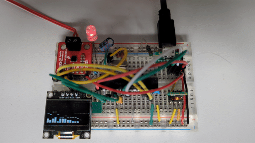

# Rust USB audio output

This is software for a USB audio output device implemented in Rust on a PIC32MX
microcontroller.

 The microcontroller generates an I2S digital audio stream.
There is also a OLED display to display the audio spectrum.
